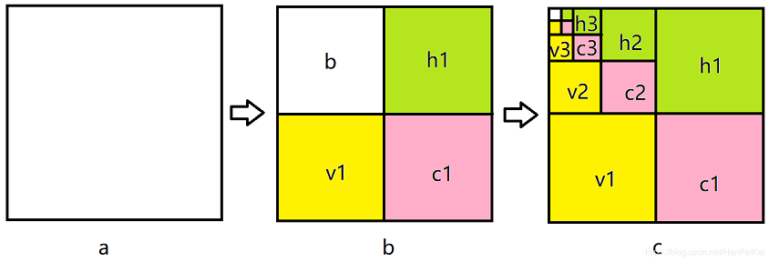
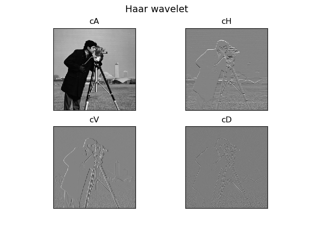

## Haar 小波

### 一维Haar变换

设原始一维数据为 `a=[a1, a2, a3, a4]`, `Haar`低通滤波器为 `[1, 1]`，
`Haar`高通滤波器为 `[-1, 1]`。则：

* 小波变换：`b=[(a1+a2)/2, (a3+a4)/2, (a1-a2)/2, (a3-a4)/2]`

* 模糊近似：`cA1=[b[0], b[1]]=[(a1+a2)/2, (a3+a4)/2]`

* 细节系数：`cD1=[b[2], b[3]]=[(a1-a2)/2, (a3-a4)/2]`

### 二维Haar变换

对于二维图像`Haar`变换不再从一个方向进行滤波，
而是从`水平`和`竖直`两个方向进行`低通`和`高通`滤波（水平和竖直先后不影响）。

`图a`表示原图，`图b`表示经过一级小波变换的结果，其中，`h1`表示水平方向的细节，
`v1`表示竖直方向的细节，`c1`表示对角线方向的细节，`b`表示下2采样的图像。
`图c`表示继续进行`Haar`小波变换。

一级`Haar`小波变换实际效果如图所示:

> 计算原理见`3_haar_wavelet.py`

`cA`表示下2采样的图像：水平低通+垂直低通

`cH`表示水平方向的细节：水平低通+垂直高通

`cV`表示竖直方向的细节：水平高通+垂直低通

`cD`表示对角线方向的细节：水平低通+垂直低通

### Reference

* [图像Haar小波变换](https://blog.csdn.net/HanFeiKei/article/details/83584963)
