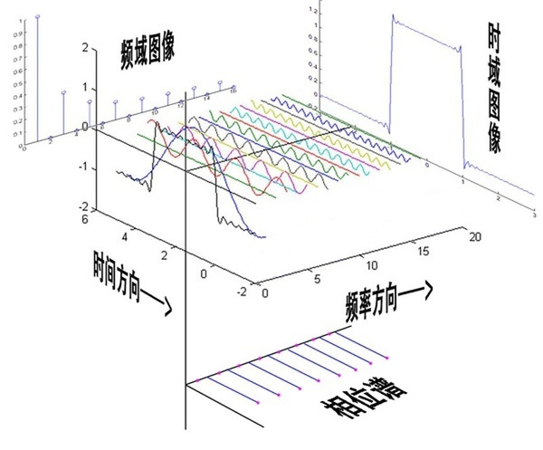

# Fourier

## 时域、频域、相位

## 图像处理

从数学意义上看，傅里叶变换是将一个函数转换为一系列周期函数来处理。
从物理效果来看，傅里叶变换是将图像从空间域转换到频率域，其逆变换是将图像从频率域转换到空间域。

换句话说，傅里叶变换的物理意义是将图像的灰度分布函数变换为图像的频率分布函数。傅里叶逆变换是将图像的频率分布函数变换为灰度分布函数。

傅里叶频谱图上明暗不一的亮点，其意义是指图像上某一点与邻域点差异的强弱，
即梯度的大小，也即该点的频率的大小。梯度越大该点的亮度越强，否则该点亮度越弱。

这样通过观察傅里叶变换后的频谱图，也叫功率图，我们就可以直观地看出图像的能量分布：
如果频谱图中暗的点数更多，那么实际图像是比较柔和的，这是因为各点与邻域差异都不大，梯度相对较小；
反之，如果频谱图中亮的点数多，那么实际图像一定是尖锐的、边界分明且边界两边像素差异较大的。

## lib

* [scipy.fftpack](https://docs.scipy.org/doc/scipy/reference/fftpack.html)

* [tutorial: scipy.fftpack](https://docs.scipy.org/doc/scipy/reference/tutorial/fftpack.html)

* [pyFFTW](http://hgomersall.github.io/pyFFTW/index.html)

## Reference

* [深入浅出的讲解傅里叶变换（真正的通俗易懂）](https://www.cnblogs.com/h2zZhou/p/8405717.html)

* [傅里叶变换通俗解释及快速傅里叶变换的python实现](https://www.cnblogs.com/tianqizhi/p/10850377.html)

* [如何理解傅里叶变换公式？](https://www.zhihu.com/question/19714540/answer/514107420)

* [怎样更好地理解并记忆泰勒展开式？](https://www.zhihu.com/question/25627482/answer/313088784)
